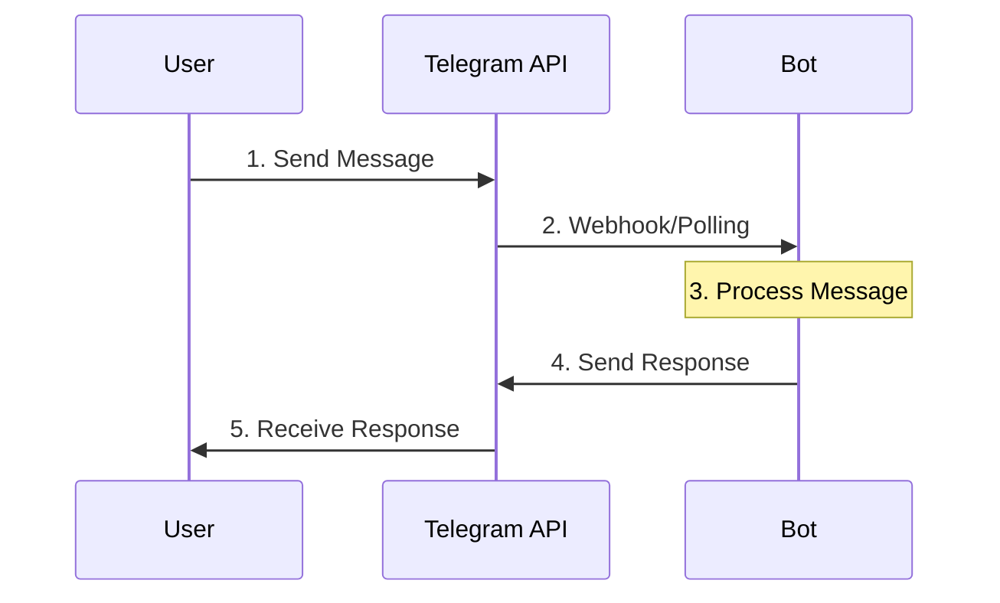
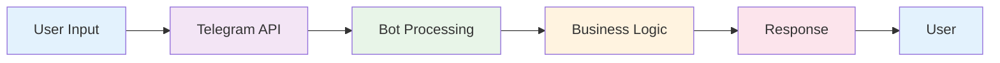

# 📊 PRESENTASI: BOT TELEGRAM

# 🤖 BOT TELEGRAM
---

## 🤖 Bot Telegram

**Definisi:**
- Program komputer yang berjalan di platform Telegram
- Berinteraksi dengan pengguna melalui pesan dan perintah
- Dapat mengirim dan menerima berbagai jenis konten

**Contoh Penggunaan:**
- Customer Service
- Notifikasi
- Data Analytics
- Automation
- Games & Entertainment

**Keunggulan:**
- Mudah diakses (via Telegram)
- Cross-platform
- Real-time communication
- Rich media support

---

## 🔄 Arsitektur Bot Telegram



---

## 🔗 API Endpoint

**Base URL:**
```
https://api.telegram.org/bot<TOKEN>/<METHOD>
```

**Contoh Request:**
```bash
curl -X POST https://api.telegram.org/bot1234567890:ABCdefGHIjklMNOpqrsTUVwxyz/sendMessage \
  -H "Content-Type: application/json" \
  -d '{
    "chat_id": 123456789,
    "text": "Hello World!"
  }'
```

**Response:**
```json
{
  "ok": true,
  "result": {
    "message_id": 123,
    "from": {...},
    "chat": {...},
    "date": 1234567890,
    "text": "Hello World!"
  }
}
```

---

## 📝 Metode API

**Update Methods:**
- `getUpdates` - Mendapatkan updates
- `setWebhook` - Set webhook URL
- `deleteWebhook` - Hapus webhook

**Message Methods:**
- `sendMessage` - Kirim pesan teks
- `sendPhoto` - Kirim foto
- `sendDocument` - Kirim dokumen
- `sendVideo` - Kirim video
- `sendAudio` - Kirim audio

**Chat Methods:**
- `getChat` - Info chat
- `getChatMembersCount` - Jumlah member
- `leaveChat` - Keluar dari chat

---

## 🚀 Telegraf.js

**Keunggulan:**
- Modern JavaScript/TypeScript
- Middleware system
- Type safety
- Extensive documentation
- Active community

**Setup Dasar:**
```typescript
import { Telegraf, Context } from 'telegraf';

const bot = new Telegraf<Context>(process.env.BOT_TOKEN);

bot.command('start', (ctx) => {
  ctx.reply('Hello! Welcome to the bot!');
});

bot.launch();
```

**Middleware:**
```typescript
bot.use(session());
bot.use(async (ctx, next) => {
  console.log('New message:', ctx.message);
  await next();
});
```

---

## 📦 Package Dependencies

**Core Dependencies:**
```json
{
  "telegraf": "^4.15.6",        // Framework bot
  "dotenv": "^16.3.1",          // Environment variables
  "typescript": "^5.3.2"        // Type safety
}
```

**Chart Generation:**
```json
{
  "puppeteer": "^21.6.1",       // Headless browser
  "amcharts": "^4.0.0"          // Chart library
}
```

**Database:**
```json
{
  "pg": "^8.11.3",              // PostgreSQL client
  "ssh2": "^1.16.0"             // SSH tunneling
}
```

---

**Flow Arsitektur:**


---

## 📝 Implementasi Basic Bot

```typescript
import { Telegraf, Context } from 'telegraf';
import * as dotenv from 'dotenv';

dotenv.config();

const bot = new Telegraf<Context>(process.env.BOT_TOKEN!);

// Basic commands
bot.command('start', async (ctx) => {
  await ctx.reply('Hello! Welcome to my bot! 🤖');
});

bot.command('help', async (ctx) => {
  await ctx.reply('Available commands: /start, /help');
});

bot.command('echo', async (ctx) => {
  const text = ctx.message.text.split(' ').slice(1).join(' ');
  await ctx.reply(`You said: ${text}`);
});

bot.launch();
```

**Fitur:**
- Command handling
- Text processing
- Error handling

---

## 🎨 Interactive Buttons

```typescript
import { Markup } from 'telegraf';

bot.command('menu', async (ctx) => {
  const keyboard = Markup.inlineKeyboard([
    [
      Markup.button.callback('📊 Charts', 'charts'),
      Markup.button.callback('⚙️ Settings', 'settings')
    ],
    [
      Markup.button.url('🌐 Website', 'https://example.com'),
      Markup.button.callback('📞 Contact', 'contact')
    ]
  ]);

  await ctx.reply('Choose an option:', keyboard);
});

// Handle callback queries
bot.action('charts', async (ctx) => {
  await ctx.answerCbQuery('📊 Loading charts...');
  await ctx.editMessageText('Chart options coming soon!');
});
```

**Fitur:**
- Interactive buttons
- Callback queries
- URL buttons
- Dynamic menus

---

## 💾 State Management

```typescript
import { session } from 'telegraf';

interface BotSession {
  step?: string;
  gameNumber?: number;
  attempts?: number;
}

interface BotContext extends Context {
  session?: BotSession;
}

const bot = new Telegraf<BotContext>(process.env.BOT_TOKEN);

bot.use(session());

// Game with session
bot.command('game', async (ctx) => {
  const number = Math.floor(Math.random() * 100) + 1;
  ctx.session!.gameNumber = number;
  ctx.session!.attempts = 0;
  ctx.session!.step = 'playing';
  
  await ctx.reply('🎮 Number Guessing Game!');
});
```

**Keunggulan:**
- Persistent state
- User-specific data
- Multi-step interactions

---

## 📊 Chart dengan Puppeteer

```typescript
import puppeteer from 'puppeteer';

class ChartService {
  async generateLineChart(data: any[]): Promise<Buffer> {
    const html = `
      <!DOCTYPE html>
      <html>
        <head>
          <script src="https://cdn.amcharts.com/lib/4/core.js"></script>
          <script src="https://cdn.amcharts.com/lib/4/charts.js"></script>
        </head>
        <body>
          <div id="chartdiv"></div>
          <script>
            var chart = am4core.create("chartdiv", am4charts.XYChart);
            chart.data = ${JSON.stringify(data)};
            // Chart configuration...
          </script>
        </body>
      </html>
    `;

    const browser = await puppeteer.launch({ headless: true });
    const page = await browser.newPage();
    await page.setContent(html);
    const screenshot = await page.screenshot();
    await browser.close();
    
    return screenshot;
  }
}
```

**Teknologi:**
- AmCharts v4
- Puppeteer
- HTML to Image

---

## 🗄️ PostgreSQL Integration

```typescript
import { Pool } from 'pg';

class DatabaseService {
  private pool: Pool;

  constructor() {
    this.pool = new Pool({
      host: process.env.DB_HOST,
      port: parseInt(process.env.DB_PORT),
      database: process.env.DB_NAME,
      user: process.env.DB_USER,
      password: process.env.DB_PASSWORD,
      max: 20,
      idleTimeoutMillis: 30000,
    });
  }

  async getLatencyData(region: string, node: string): Promise<any[]> {
    const query = `
      SELECT date, avg_latency, min_latency, max_latency
      FROM latency_data 
      WHERE region = $1 AND node = $2 
      ORDER BY date ASC
    `;
    return await this.query(query, [region, node]);
  }
}
```

**Fitur:**
- Connection pooling
- Parameterized queries
- Error handling
- SSH tunneling

---

## 🔐 Secure Database Connection

```typescript
import { Client } from 'ssh2';

class SSHTunnelService {
  async createTunnel(): Promise<void> {
    return new Promise((resolve, reject) => {
      this.client.connect({
        host: process.env.DB_SSH_HOST,
        port: parseInt(process.env.DB_SSH_PORT),
        username: process.env.DB_SSH_USERNAME,
        password: process.env.DB_SSH_PASSWORD,
      });

      this.client.on('ready', () => {
        console.log('SSH tunnel established');
        resolve();
      });
    });
  }
}
```

**Keamanan:**
- Encrypted connection
- Authentication
- Port forwarding
- Key-based auth

---

## ⚡ Performance Optimization

```typescript
import { spawn } from 'child_process';

class ImageProcessor {
  async processImage(data: any): Promise<Buffer> {
    return new Promise((resolve, reject) => {
      const worker = spawn('node', ['dist/workers/imageWorker.js']);
      
      worker.send({ type: 'generate', data });
      
      worker.on('message', (result) => {
        if (result.type === 'success') {
          resolve(Buffer.from(result.data));
        } else {
          reject(new Error(result.error));
        }
      });
    });
  }
}
```

**Keunggulan:**
- Isolated processing
- Memory management
- Crash isolation
- Scalability

---

## 🔒 Security & Performance

**Security:**
```typescript
// ✅ Environment variables
const BOT_TOKEN = process.env.BOT_TOKEN;

// ✅ Input validation
if (text.length > 1000) {
  return ctx.reply('Message too long!');
}

// ✅ Rate limiting
const rateLimit = new Map();
bot.use(async (ctx, next) => {
  const userId = ctx.from?.id;
  const now = Date.now();
  if (now - rateLimit.get(userId) < 1000) {
    return ctx.reply('Please wait...');
  }
  rateLimit.set(userId, now);
  await next();
});
```

**Performance:**
- Connection pooling
- Caching
- Error handling
- Logging

---

## 🛡️ Robust Error Management

```typescript
// Global error handler
bot.catch((err, ctx) => {
  console.error(`Error for ${ctx.updateType}:`, err);
  ctx.reply('Sorry, something went wrong!').catch(console.error);
});

// Try-catch in commands
bot.command('chart', async (ctx) => {
  try {
    const chart = await chartService.generateChart(data);
    await ctx.replyWithPhoto({ source: chart });
  } catch (error) {
    console.error('Chart generation error:', error);
    await ctx.reply('Failed to generate chart. Please try again.');
  }
});
```

**Strategi:**
- Global error handling
- Command-specific error handling
- User-friendly error messages
- Logging for debugging

---

## 🚀 Production Deployment

**PM2 Deployment:**
```javascript
// ecosystem.config.js
module.exports = {
  apps: [{
    name: 'telegram-bot',
    script: 'dist/index.js',
    instances: 1,
    autorestart: true,
    max_memory_restart: '1G',
    env: {
      NODE_ENV: 'production',
      BOT_TOKEN: 'your_bot_token_here'
    }
  }]
};
```

**Docker Deployment:**
```dockerfile
FROM node:18-alpine
WORKDIR /app
COPY package*.json ./
RUN npm ci --only=production
COPY . .
RUN npm run build
CMD ["npm", "start"]
```

---

## 📊 Production Monitoring

**Logging:**
```typescript
// Debug mode
if (process.env.NODE_ENV === 'development') {
  bot.use(async (ctx, next) => {
    console.log('Update:', JSON.stringify(ctx.update, null, 2));
    await next();
  });
}

// Error logging
bot.catch((err, ctx) => {
  console.error('Bot error:', {
    error: err.message,
    stack: err.stack,
    update: ctx.update
  });
});
```

**Monitoring:**
- PM2 monitoring
- Application metrics
- Error tracking
- Performance monitoring

---

## 🎬 Live Demo

**Demo Agenda:**
1. **Bot Sederhana**
   - `/start` command
   - `/help` command
   - `/echo` command

2. **Interactive Bot**
   - Inline keyboards
   - Callback queries
   - Menu navigation

3. **Chart Bot**
   - Generate sample chart
   - Send chart as image
   - Error handling

4. **Database Bot**
   - Fetch latency data
   - Generate chart from DB
   - SSH tunneling

---

## 📚 Learning Resources

**Dokumentasi Resmi:**
- [Telegram Bot API](https://core.telegram.org/bots/api)
- [Telegraf.js Documentation](https://telegraf.js.org/)
- [TypeScript Documentation](https://www.typescriptlang.org/)

**Tutorial & Examples:**
- [BotFather Guide](https://core.telegram.org/bots#how-do-i-create-a-bot)
- [Telegraf.js Examples](https://github.com/telegraf/telegraf/tree/master/docs/examples)
- [Puppeteer Documentation](https://pptr.dev/)

**Tools & Libraries:**
- [AmCharts](https://www.amcharts.com/)
- [PostgreSQL](https://www.postgresql.org/)
- [SSH2](https://github.com/mscdex/ssh2)

---

## 🎯 Key Takeaways

**Yang Sudah Dipelajari:**
1. ✅ Konsep dasar bot Telegram dan API
2. ✅ Framework Telegraf.js dan setup
3. ✅ Arsitektur modular untuk bot
4. ✅ Chart generation dengan Puppeteer
5. ✅ Database integration dengan PostgreSQL
6. ✅ Best practices untuk security dan performance
7. ✅ Deployment dan monitoring

**Next Steps:**
1. **Praktik**: Implementasikan bot sederhana
2. **Eksplorasi**: Coba fitur-fitur advanced
3. **Optimasi**: Terapkan best practices
4. **Deploy**: Deploy ke production environment

---

## 🙏 Terima Kasih

**Contact Information:**
- 📧 Email: [your.email@company.com]
- 💬 Telegram: [@your_telegram]
- 🐛 Issues: [GitHub Repository]

**Feedback:**
- Silakan berikan feedback untuk materi ini
- Saran untuk improvement sangat dihargai
- Pertanyaan lebih lanjut bisa ditanyakan

---
