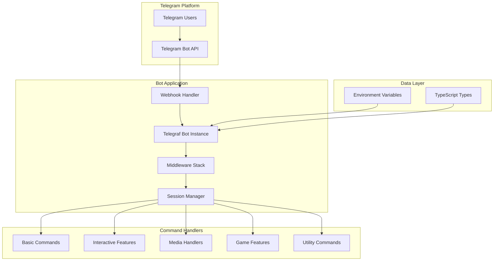
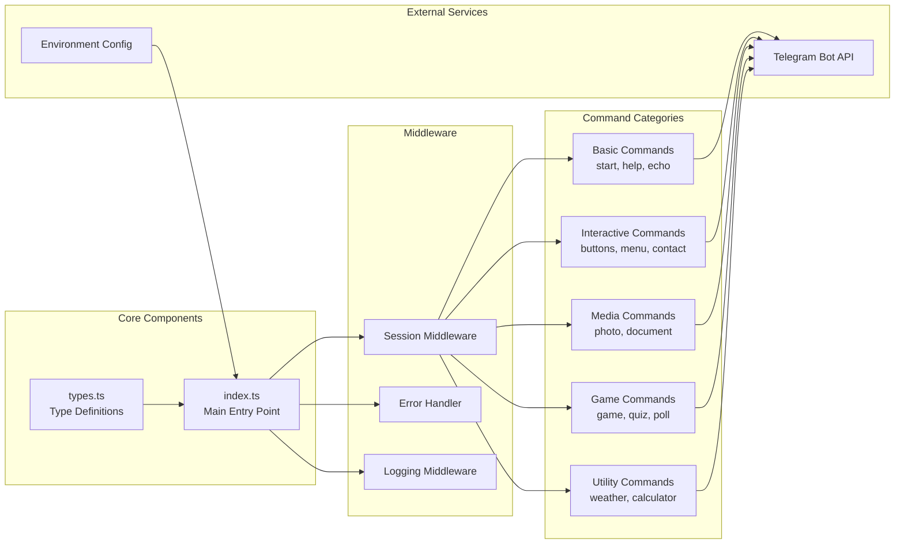
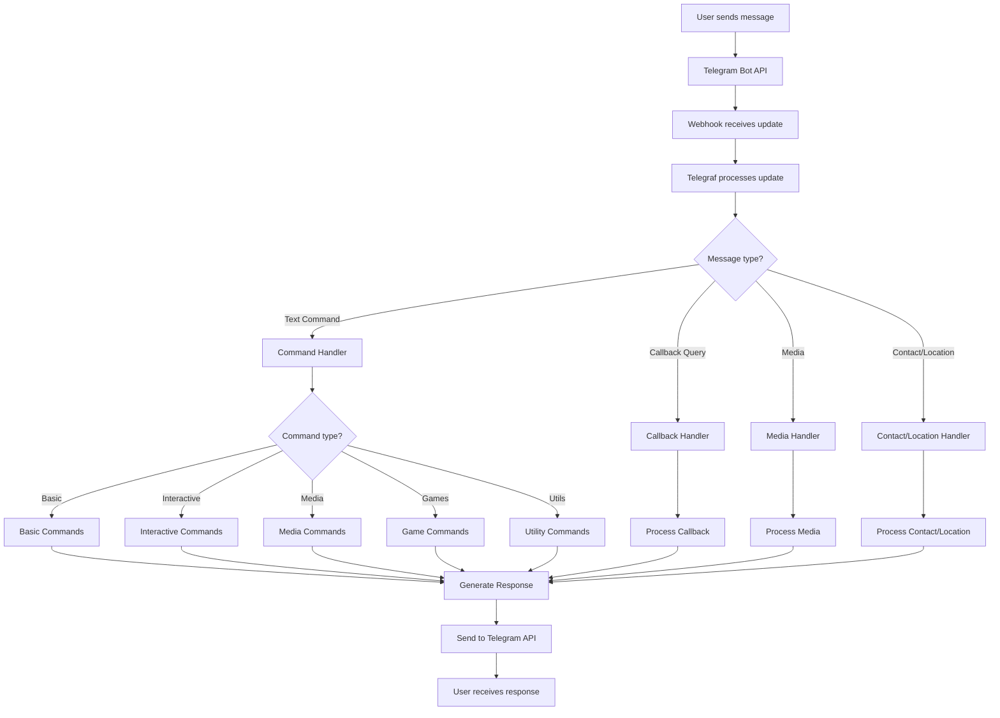
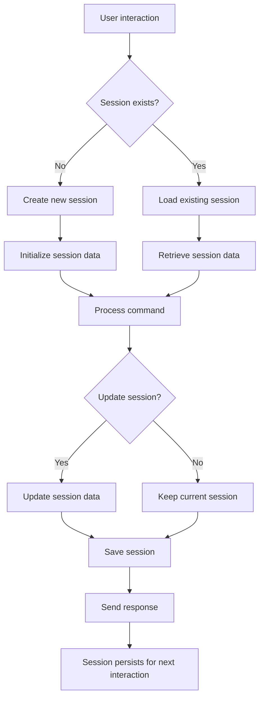
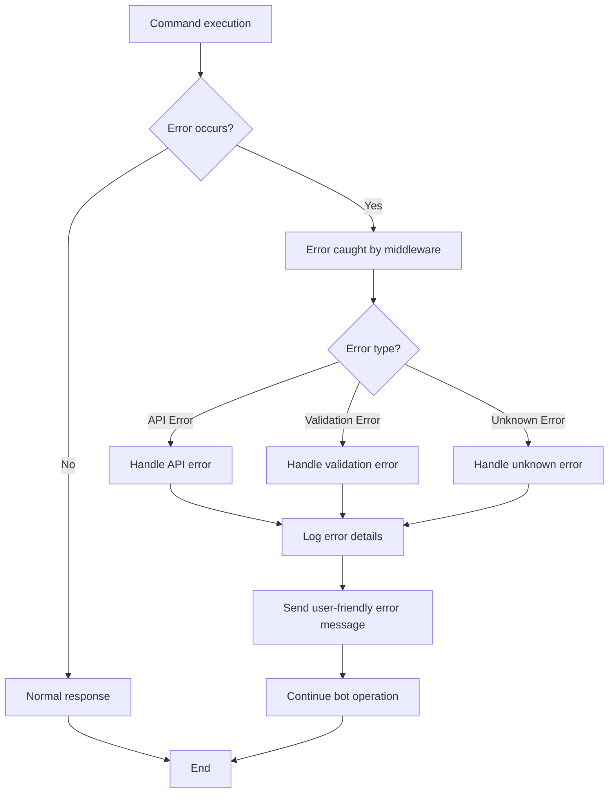
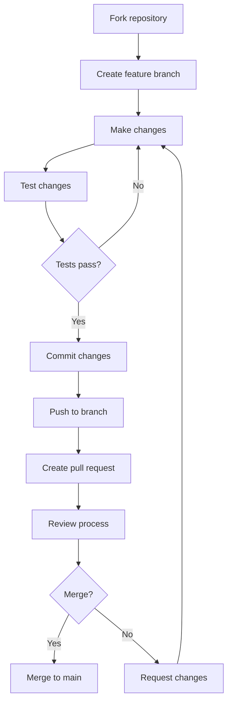
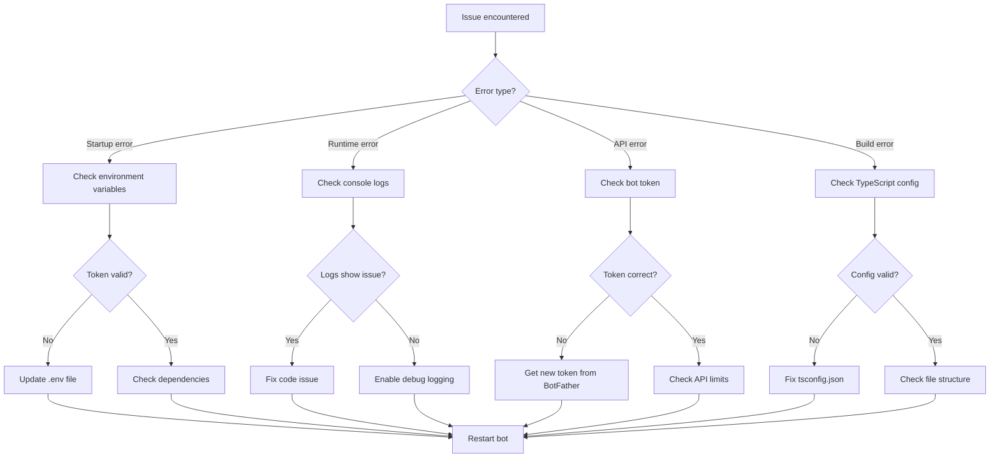

# 🤖 Telegram Bot TypeScript Demo

A comprehensive Telegram bot built with TypeScript and Telegraf.js that demonstrates all the basic features and methods available in the Telegraf framework.

## 📋 Table of Contents

- [Features](#-features)
- [Architecture](#-architecture)
- [System Flow](#-system-flow)
- [Setup Instructions](#️-setup-instructions)
- [Project Structure](#-project-structure)
- [Available Commands](#-available-commands)
- [Development Guide](#-development-guide)
- [Deployment](#-deployment)
- [Contributing](#-contributing)

## 🚀 Features

### 📋 Basic Commands
- `/start` - Welcome message and bot introduction
- `/help` - Comprehensive help guide
- `/echo [text]` - Echo your message back

### 🎯 Interactive Features
- `/buttons` - Inline keyboard buttons demonstration
- `/menu` - Multi-level menu system
- `/contact` - Request contact information
- `/location` - Request location sharing

### 📱 Media Handling
- `/photo` - Send sample photos with interactive buttons
- `/document` - Send sample documents
- Handle user-uploaded photos, documents, and voice messages

### 🎮 Fun Features
- `/poll` - Create interactive polls
- `/quiz` - Create quizzes with explanations
- `/game` - Number guessing game with session management
- `/weather` - Weather simulation
- `/calculator` - Interactive calculator

### 🔧 Advanced Features
- Session management for user data
- Error handling and graceful shutdown
- TypeScript type safety
- Modular code structure

## 🏗️ Architecture

### System Architecture Diagram



### Component Architecture



## 🔄 System Flow

### Message Processing Flow



### Session Management Flow



### Error Handling Flow



## 🛠️ Setup Instructions

### Prerequisites
- Node.js (v18 or higher)
- npm or yarn
- A Telegram bot token (get from [@BotFather](https://t.me/BotFather))

### Installation

1. **Clone or download this project**
   ```bash
   git clone <repository-url>
   cd bot-telegram-base
   ```

2. **Install dependencies**
   ```bash
   npm install
   ```

3. **Set up environment variables**
   ```bash
   # Copy the example environment file
   cp env.example .env
   
   # Edit .env and add your bot token
   BOT_TOKEN=your_bot_token_here
   OPENWEATHER_API_KEY=your_api_key_here
   ```

4. **Build the project**
   ```bash
   npm run build
   ```

5. **Start the bot**
   ```bash
   # Development mode (with auto-restart)
   npm run dev
   
   # Production mode
   npm start
   ```

## 📁 Project Structure

```
bot-telegram-base/
├── src/
│   ├── index.ts          # Main bot file with all commands and handlers
│   └── types.ts          # TypeScript type definitions
├── dist/                 # Compiled JavaScript files (generated)
├── package.json          # Dependencies and scripts
├── tsconfig.json         # TypeScript configuration
├── env.example           # Environment variables template
└── README.md            # This file
```

## 🎯 Available Commands

### Basic Commands
- `/start` - Welcome message and feature overview
- `/help` - Detailed help information
- `/echo [text]` - Echo your message

### Interactive Menus
- `/buttons` - Simple inline keyboard
- `/menu` - Multi-level menu system with categories

### Media Commands
- `/photo` - Send random photos with interactive buttons
- `/document` - Send sample documents

### Interactive Features
- `/contact` - Request contact information
- `/location` - Request location sharing
- `/poll` - Create a poll about programming languages
- `/quiz` - Create a quiz about HTML

### Utility Commands
- `/weather` - Simulated weather information
- `/calculator` - Interactive calculator
- `/game` - Number guessing game

## 🔧 Development

### Available Scripts
- `npm run dev` - Start in development mode with auto-restart
- `npm run build` - Compile TypeScript to JavaScript
- `npm start` - Start the compiled bot
- `npm run watch` - Watch for changes and auto-restart

### Adding New Features

1. **Add commands** in `src/index.ts`
2. **Add callback handlers** in the same file
3. **Update types** in `src/types.ts` if needed
4. **Test your changes** with `npm run dev`


## 🎮 Interactive Features

### Menu System
The bot includes a comprehensive menu system with:
- Media menu (photos, documents, audio, video)
- Games menu (number game, quiz)
- Tools menu (calculator, weather)
- Info menu (about, version)

### Session Management
The bot uses Telegraf's session middleware to store:
- Game state (secret number, attempts)
- Calculator state (display, operations)

### Error Handling
- Graceful error handling for all operations
- User-friendly error messages
- Automatic bot shutdown on SIGINT/SIGTERM

## 📱 Bot Features Demonstrated

### Inline Keyboards
- Callback buttons
- URL buttons
- Contact request buttons
- Location request buttons

### Message Types
- Text messages
- Photos
- Documents
- Voice messages
- Polls and quizzes

### Interactive Elements
- Reply keyboards
- Inline keyboards
- Callback queries
- Session management

## 🔒 Security Notes

- Never commit your `.env` file
- Keep your bot token secure
- Use environment variables for sensitive data
- Consider rate limiting for production use

## 🚀 Deployment

### Local Development
```bash
npm run dev
```

### Production
```bash
npm run build
npm start
```

## 📚 Learning Resources

- [Telegraf.js Documentation](https://telegraf.js.org/)
- [Telegram Bot API](https://core.telegram.org/bots/api)
- [TypeScript Documentation](https://www.typescriptlang.org/)

## 🤝 Contributing

Feel free to contribute to this project by:
- Adding new features
- Improving documentation
- Fixing bugs
- Adding tests

### Contribution Flow



## 📄 License

This project is licensed under the MIT License.

## 🆘 Support

If you encounter any issues:
1. Check the console for error messages
2. Verify your bot token is correct
3. Ensure all dependencies are installed
4. Check the Telegraf.js documentation

### Troubleshooting Flow



---

**Made with ❤️ using TypeScript and Telegraf.js**