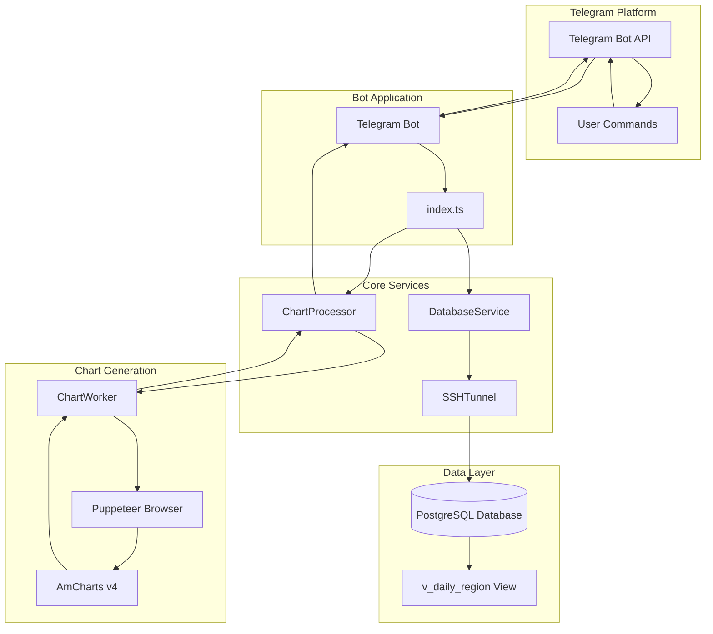
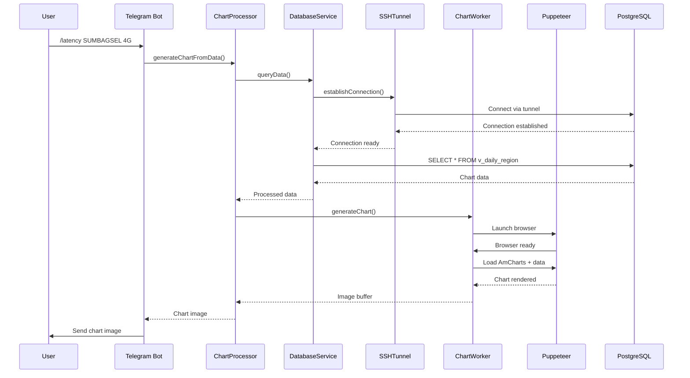
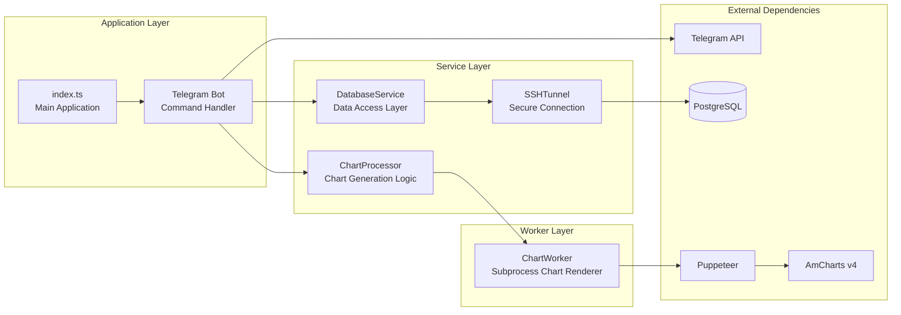

# Telegram Chart Bot 📊

A powerful Telegram bot that generates beautiful charts using AmCharts v4 and PostgreSQL data. Features a reusable chart architecture that supports both data-driven and HTML template-based chart generation.

## Features ✨

- **📊 Multiple Chart Types**: Line, column, and area charts
- **🎨 Operator-based Legends**: Automatic color-coded legends for telecom operators
- **🔄 Reusable Architecture**: Modular chart processor supporting both data and HTML inputs
- **🐘 PostgreSQL Integration**: Direct database connectivity with connection pooling
- **🔗 SSH Tunnel Support**: Secure database connections through SSH tunneling
- **⚡ Performance**: Puppeteer-based chart rendering with subprocess isolation
- **🛡️ Type Safety**: Full TypeScript implementation with comprehensive interfaces

## System Architecture 🏗️

### High-Level Architecture



### Data Flow Architecture



### Component Architecture


 
## Quick Start 🚀

### Prerequisites

- Node.js 18+ 
- PostgreSQL database
- Telegram Bot Token ([Get from @BotFather](https://t.me/BotFather))
- Optional: SSH server access (if database is behind firewall)

### Installation

1. **Clone and install dependencies:**
```bash
git clone <repository-url>
cd bot-telegram-postgres
npm install
```

2. **Configure environment:**
```bash
cp env.example .env
# Edit .env with your configuration
```

3. **Build and start:**
```bash
npm run build
npm start
```

## Environment Configuration 🔧

Create a `.env` file based on `env.example`:

```env
# Telegram Bot Token (get from @BotFather)
BOT_TOKEN=your_telegram_bot_token_here

# PostgreSQL Database Configuration
DB_HOST=localhost
DB_PORT=5432
DB_NAME=bot_telegram
DB_USER=postgres
DB_PASSWORD=your_password_here

# SSH Tunnel Configuration (optional)
DB_USE_SSH=false
DB_SSH_HOST=your-ssh-server
DB_SSH_PORT=22
DB_SSH_USERNAME=root
DB_SSH_PASSWORD=your-ssh-password
DB_SSH_PRIVATE_KEY=
DB_SSH_PASSPHRASE=
DB_LOCAL_PORT=15432

# Optional: Set to true for development mode
NODE_ENV=development
```

### SSH Tunnel Configuration

If your PostgreSQL database is behind a firewall or requires secure access, enable SSH tunneling:

#### Password Authentication
```env
# Enable SSH tunnel
DB_USE_SSH=true
DB_SSH_HOST=your-ssh-server.com
DB_SSH_PORT=22
DB_SSH_USERNAME=your-username
DB_SSH_PASSWORD=your-ssh-password
DB_LOCAL_PORT=15432
```

#### Private Key Authentication (Recommended)
```env
# Enable SSH tunnel with private key
DB_USE_SSH=true
DB_SSH_HOST=your-ssh-server.com
DB_SSH_PORT=22
DB_SSH_USERNAME=your-username
DB_SSH_PRIVATE_KEY=/path/to/your/private/key
DB_SSH_PASSPHRASE=your-key-passphrase  # if key is encrypted
DB_LOCAL_PORT=15432
```

**Benefits of SSH tunneling:**
- 🔒 **Encrypted Connection**: All database traffic encrypted through SSH
- 🛡️ **Firewall Bypass**: Access databases behind corporate firewalls
- 🔑 **Key-based Auth**: Secure authentication with SSH keys
- 🚇 **Port Forwarding**: Local port forwarding to remote database
- 📊 **Connection Monitoring**: Detailed logging of tunnel status

**How it works:**
1. Bot establishes SSH connection to jump server
2. Creates local port forward (default: 15432) 
3. PostgreSQL connects to localhost:15432
4. Traffic tunneled securely through SSH to remote database

## Bot Commands 🤖

### Available Commands

- `/start` - Welcome message and command overview
- `/help` - Detailed help and usage instructions
- `/chart` - Generate sample chart with random data
- `/latency [region] [node]` - Show network latency data for last 30 days

### Latency Command Usage

```bash
# Default: SUMBAGSEL region, 4G node
/latency

# Specify region and node
/latency SUMBAGSEL 4G

# Different region
/latency JABAR 3G
```

## Reusable Chart Architecture 🏗️

The bot features a flexible chart generation system with two modes:

### 1. Data Mode - Configuration-Driven Charts

```typescript
import { ChartProcessor } from './services/ChartProcessor';

const chartProcessor = new ChartProcessor();

// Generate KPI chart with operator data
const chartData = [
  { date: '2024-01-01', operator: 'Telkomsel', value: 25.5 },
  { date: '2024-01-01', operator: 'Indosat', value: 28.2 },
  // ... more data
];

const imageBuffer = await chartProcessor.generateChartFromData(chartData, {
  title: 'Network Latency by Operator',
  kpiName: 'Latency',
  unit: 'ms',
  chartType: 'line',
  template: 'kpi',
  width: 1200,
  height: 700
});
```

### 2. HTML Mode - Custom Template Charts

```typescript
// Create custom HTML template
const customHtml = chartProcessor.createCustomHTML(data, {
  title: 'Custom Chart',
  chartLibrary: 'amcharts',
  customCSS: 'body { background: #f0f0f0; }',
  customJS: '/* Custom AmCharts configuration */'
});

// Generate chart from HTML
const imageBuffer = await chartProcessor.generateChartFromHTML(customHtml);
```

## Chart Types & Templates 📈

### Available Chart Types
- **Line Charts**: Ideal for trends and time series
- **Column Charts**: Perfect for comparisons
- **Area Charts**: Great for showing volume over time

### Built-in Templates
- **KPI Template**: Multi-operator charts with legends
- **Simple Template**: Basic single-series charts
- **Custom Template**: Full HTML/CSS/JS control

## Database Schema 🗄️

The bot expects PostgreSQL data with this structure:

```sql
-- Example table structure
CREATE VIEW bot_telegram.v_daily_region AS
SELECT 
    level,
    "Area",
    dateid,
    region,
    operator,
    node,
    sample,
    download_throughput,
    upload_throughput,
    latency,
    jitter,
    packetloss,
    -- ... other KPI fields
FROM your_source_table;
```

## Development 👨‍💻

### Project Structure

```
src/
├── services/
│   ├── ChartProcessor.ts      # Reusable chart generation
│   ├── DatabaseService.ts     # PostgreSQL connectivity
│   └── SSHTunnel.ts          # SSH tunnel management
├── workers/
│   └── chartWorker.ts         # Generic chart worker
└── index.ts                   # Main bot application

examples/
└── chartProcessor-demo.ts     # Usage examples
```

### Build Process

The build process includes TypeScript compilation and worker file copying:

```bash
npm run build    # Compile TypeScript + copy workers
npm run dev      # Development mode with ts-node
npm run watch    # Watch mode for development
```

### Testing the Chart Processor

Run the included demo to test chart generation:

```bash
npm run build
node dist/examples/chartProcessor-demo.js
```

## Chart Customization 🎨

### Color Schemes

Default operator colors:
- Telkomsel: `#FF6B6B` (Red)
- Indosat: `#4ECDC4` (Teal)  
- XL: `#45B7D1` (Blue)
- Custom operators: Auto-assigned from palette

### Custom Styling

```typescript
// Example: Custom gradient background
const customHtml = chartProcessor.createCustomHTML(data, {
  customCSS: `
    body { 
      background: linear-gradient(135deg, #667eea 0%, #764ba2 100%);
    }
    #chartdiv { 
      border-radius: 15px;
      box-shadow: 0 10px 30px rgba(0,0,0,0.3);
    }
  `
});
```

## Performance & Scaling 🚀

- **Connection Pooling**: PostgreSQL pool with configurable limits
- **Subprocess Isolation**: Chart rendering in separate processes
- **Memory Management**: Automatic cleanup of browser instances
- **Timeout Protection**: Configurable timeouts for chart generation

## Troubleshooting 🔧

### Common Issues

1. **Chart Worker Not Found**
   ```bash
   npm run build  # Ensure workers are compiled and copied
   ```

2. **Database Connection Failed**
   - Check PostgreSQL credentials in `.env`
   - Verify database accessibility
   - Ensure table `bot_telegram.v_daily_region` exists

3. **Chart Generation Timeout**
   - Increase timeout in chart options
   - Check available memory
   - Verify AmCharts CDN accessibility

### Debug Mode

Enable detailed logging:
```env
NODE_ENV=development
```

## Contributing 🤝

1. Fork the repository
2. Create a feature branch: `git checkout -b feature/amazing-feature`
3. Commit changes: `git commit -m 'Add amazing feature'`
4. Push to branch: `git push origin feature/amazing-feature`
5. Open a Pull Request

## License 📝

This project is licensed under the MIT License - see the LICENSE file for details.

## Architecture Benefits 🏆

### Reusability
- Single `ChartProcessor` handles multiple chart types
- Configurable templates for different use cases
- Easy integration with any data source

### Flexibility  
- Data-driven charts with simple configuration
- HTML templates for complete customization
- Support for multiple chart libraries

### Maintainability
- Clear separation of concerns
- TypeScript interfaces for type safety
- Modular architecture for easy testing

### Security
- SSH tunnel support for secure database access
- Connection pooling for performance
- Subprocess isolation for chart rendering

---

**Built with ❤️ using TypeScript, AmCharts v4, and PostgreSQL**
