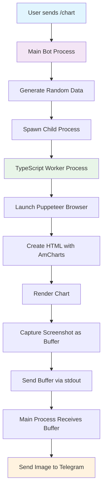

# Telegram Chart Bot

A Telegram bot that generates beautiful charts using AmCharts v4 and Puppeteer. The bot creates line charts with sample data and sends them as images to users using **subprocess-based image processing** for better performance and isolation.

## Features

- 📊 Generate line charts with AmCharts v4
- 🖼️ Convert charts to images using Puppeteer in **child processes**
- 🔄 **Buffer-based image processing** - no temporary files needed
- 🤖 Telegram bot interface with Telegraf.js
- 🎨 Beautiful, modern chart styling
- ⚡ **Subprocess isolation** for better stability and performance
- 📱 Responsive and user-friendly
- 🔧 **TypeScript worker processes** for better type safety

## Prerequisites

- Node.js (v16 or higher)
- Yarn package manager
- A Telegram bot token (get from [@BotFather](https://t.me/botfather))

## Installation

1. **Clone or download this project**

2. **Install dependencies:**
   ```bash
   yarn install
   ```

3. **Set up environment variables:**
   ```bash
   cp env.example .env
   ```
   
   Edit `.env` and add your Telegram bot token:
   ```
   BOT_TOKEN=your_telegram_bot_token_here
   NODE_ENV=development
   ```

## Usage

### Development Mode
```bash
yarn build  # Build the TypeScript workers first
yarn dev    # Run the bot in development mode
```

### Production Mode
```bash
yarn build  # Build the TypeScript workers
yarn start  # Run the compiled bot
```

### Watch Mode (for development)
```bash
yarn watch  # Watch for TypeScript changes
```

## Bot Commands

- `/start` - Welcome message and available commands
- `/help` - Show help information
- `/chart` - Generate a sample line chart with random data

## How It Works

1. **User sends `/chart` command**
2. **Bot generates random data** (30 data points over the last 30 days)
3. **Spawns compiled TypeScript worker process** with Puppeteer for image generation
4. **Creates HTML with AmCharts v4** - Beautiful, interactive chart
5. **Renders chart in subprocess** and captures as buffer
6. **Sends the image buffer** directly to Telegram (no file I/O)

## Architecture

### Subprocess Image Processing

The bot uses a **child process architecture** for image generation:



### Process Flow


### Benefits

- ✅ **Isolation**: Browser crashes don't affect the main bot
- ✅ **Performance**: Parallel processing capabilities
- ✅ **Memory Management**: Automatic cleanup of browser instances
- ✅ **No File I/O**: Direct buffer transfer to Telegram
- ✅ **Timeout Protection**: Configurable timeouts for image generation
- ✅ **Type Safety**: TypeScript workers with proper interfaces
- ✅ **Simplified Deployment**: Always uses compiled JS workers

### Project Structure

```
├── src/
│   ├── index.ts                    # Main bot entry point
│   ├── services/
│   │   ├── ImageProcessor.ts       # Subprocess image processing service
│   │   └── ChartGenerator.ts       # Legacy file-based generator (kept for reference)
│   └── workers/
│       └── imageWorker.ts          # TypeScript child process worker
├── dist/                           # Compiled JavaScript (auto-created)
│   ├── services/
│   │   ├── ImageProcessor.js       # Compiled image processor
│   │   └── imageWorker.js          # Compiled worker (copied from workers/)
│   └── workers/
│       └── imageWorker.js          # Compiled TypeScript worker
├── package.json
├── tsconfig.json
├── env.example
└── README.md
```

## Chart Features

- **Line Chart** with smooth animations
- **Date Axis** showing the last 30 days
- **Interactive Elements** (cursor, zoom, scrollbar)
- **Modern Styling** with shadows and rounded corners
- **Responsive Design** optimized for mobile viewing

## Customization

### Adding New Chart Types

You can extend the `ImageProcessor` class to support different chart types:

```typescript
// Example: Add bar chart method
public async generateBarChartAsBuffer(data: ChartData[]): Promise<Buffer> {
  // Implementation for bar charts using subprocess
}
```

### Modifying Chart Styling

Edit the `createChartHTML` function in `src/workers/imageWorker.ts` to customize:
- Colors and themes
- Chart dimensions
- Fonts and styling
- Animation effects

### Adding New Commands

Add new commands in `src/index.ts`:

```typescript
bot.command('barchart', async (ctx) => {
  const data = imageProcessor.generateRandomData();
  const imageBuffer = await imageProcessor.generateBarChartAsBuffer(data);
  await ctx.replyWithPhoto({ source: imageBuffer });
});
```

### Configuration Options

The `ImageProcessor` supports various options:

```typescript
const imageBuffer = await imageProcessor.generateChartAsBuffer(data, {
  width: 840,        // Image width
  height: 560,       // Image height
  timeout: 30000     // Process timeout in milliseconds
});
```

## TypeScript Worker Benefits

### Type Safety
- **Interface Definitions**: Proper types for `ChartData` and `WorkerInput`
- **Error Handling**: Type-safe error handling with proper error types
- **Compile-time Checks**: Catch errors before runtime

### Maintainability
- **Better IDE Support**: IntelliSense and autocomplete
- **Refactoring Safety**: TypeScript ensures consistency across changes
- **Documentation**: Types serve as inline documentation

## Troubleshooting

### Common Issues

1. **Worker script not found**
   - **Solution**: Run `yarn build` to compile TypeScript workers
   - **Check**: Ensure `dist/workers/imageWorker.js` exists

2. **Puppeteer fails to launch in subprocess**
   - On Linux: Install additional dependencies: `sudo apt-get install -y gconf-service libasound2 libatk1.0-0 libc6 libcairo2 libcups2 libdbus-1-3 libexpat1 libfontconfig1 libgcc1 libgconf-2-4 libgdk-pixbuf2.0-0 libglib2.0-0 libgtk-3-0 libnspr4 libpango-1.0-0 libpangocairo-1.0-0 libstdc++6 libx11-6 libx11-xcb1 libxcb1 libxcomposite1 libxcursor1 libxdamage1 libxext6 libxfixes3 libxi6 libxrandr2 libxrender1 libxss1 libxtst6 ca-certificates fonts-liberation libappindicator1 libnss3 lsb-release xdg-utils wget`

3. **Image processing timeout**
   - Increase the timeout value in the options
   - Check internet connection for AmCharts CDN

4. **Bot token not working**
   - Verify your bot token is correct
   - Make sure the bot is not blocked by users

5. **Charts not generating**
   - Check internet connection (needed for AmCharts CDN)
   - Verify Puppeteer installation
   - Check console logs for subprocess errors

## Performance Considerations

### Subprocess Benefits
- **Memory Isolation**: Browser memory is cleaned up automatically
- **Crash Protection**: Subprocess crashes don't affect the main bot
- **Parallel Processing**: Multiple chart requests can be processed simultaneously
- **Resource Management**: Better control over browser instances

### Optimization Tips
- Adjust timeout values based on your server performance
- Monitor memory usage in production
- Consider implementing request queuing for high traffic

## Dependencies

- **telegraf**: Telegram bot framework
- **puppeteer**: Headless browser for chart rendering
- **dotenv**: Environment variable management
- **typescript**: Type safety and modern JavaScript features

## License

MIT License - feel free to use this project for your own bots!

## Contributing

1. Fork the repository
2. Create a feature branch
3. Make your changes
4. Test thoroughly
5. Submit a pull request

## Support

If you encounter any issues or have questions, please open an issue on GitHub or contact the maintainer. 