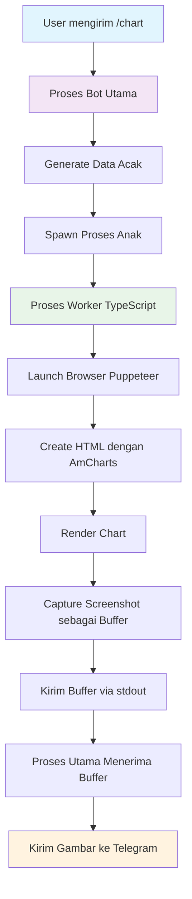
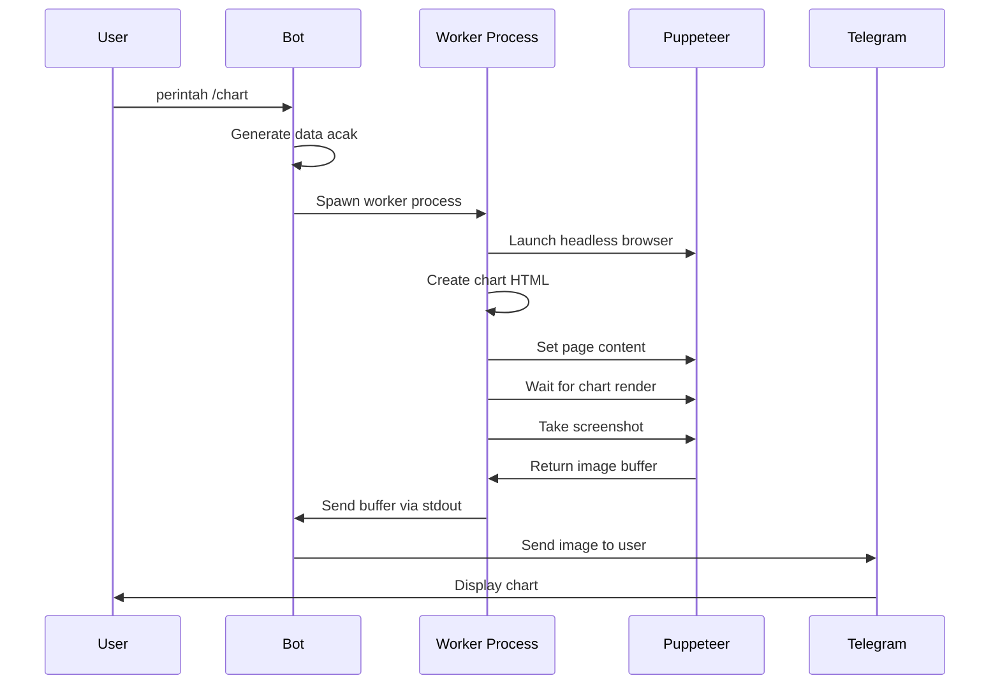

# Telegram Chart Bot

Bot Telegram yang menghasilkan grafik menggunakan AmCharts v4 dan Puppeteer. Bot ini membuat grafik garis dengan data sampel dan mengirimkannya sebagai gambar kepada pengguna menggunakan **pemrosesan gambar berbasis subprocess** untuk performa dan isolasi yang lebih baik.

## Fitur

- 📊 Menghasilkan grafik garis dengan AmCharts v4
- 🖼️ Mengkonversi grafik menjadi gambar menggunakan Puppeteer dalam **child process**
- 🔄 **Pemrosesan gambar berbasis buffer** - tidak memerlukan file sementara
- 🤖 Antarmuka bot Telegram dengan Telegraf.js
- 🎨 Styling grafik yang modern
- ⚡ **Isolasi subprocess** untuk stabilitas dan performa lebih baik
- 📱 Responsif dan ramah pengguna
- 🔧 **Proses worker TypeScript** untuk keamanan tipe lebih baik

## Prasyarat

- Node.js (v16 atau lebih tinggi)
- Package manager Yarn / NPM / PNPM
- Token bot Telegram (dapatkan dari [@BotFather](https://t.me/botfather))

## Instalasi

1. **Clone atau download project ini**

2. **Install dependencies:**
   ```bash
   yarn install
   ```

3. **Setup environment variables:**
   ```bash
   cp env.example .env
   ```
   
   Edit `.env` dan tambahkan token bot Telegram Anda:
   ```
   BOT_TOKEN=token_bot_telegram_anda_disini
   NODE_ENV=development
   ```

## Penggunaan

### Mode Development
```bash
yarn build  # Build worker TypeScript terlebih dahulu
yarn dev    # Jalankan bot dalam mode development
```

### Mode Production
```bash
yarn build  # Build worker TypeScript
yarn start  # Jalankan bot yang sudah dikompilasi
```

### Mode Watch (untuk development)
```bash
yarn watch  # Watch perubahan TypeScript
```

## Perintah Bot

- `/start` - Pesan selamat datang dan perintah yang tersedia
- `/help` - Tampilkan informasi bantuan
- `/chart` - Menghasilkan grafik garis sampel dengan data acak

## Cara Kerja

1. **Pengguna mengirim perintah `/chart`**
2. **Bot menghasilkan data acak** (30 data selama 30 hari terakhir)
3. **Spawn proses worker TypeScript yang dikompilasi** dengan Puppeteer untuk pembuatan gambar
4. **Membuat HTML dengan AmCharts v4** - Grafik interaktif
5. **Render grafik dalam subprocess** dan capture sebagai buffer
6. **Mengirim buffer gambar** langsung ke Telegram (tanpa I/O file)

## Arsitektur

### Pemrosesan Gambar Subprocess

Bot menggunakan **arsitektur child prosess** untuk pembuatan gambar:



### Alur Proses



### Keuntungan

- ✅ **Isolasi**: Crash browser tidak mempengaruhi bot utama
- ✅ **Performa**: Kemampuan pemrosesan paralel
- ✅ **Manajemen Memori**: Pembersihan otomatis instance browser
- ✅ **Tanpa File I/O**: Transfer buffer langsung ke Telegram
- ✅ **Perlindungan Timeout**: Timeout yang dapat dikonfigurasi untuk pembuatan gambar
- ✅ **Keamanan Tipe**: Worker TypeScript dengan interface yang tepat
- ✅ **Deployment Sederhana**: Selalu menggunakan worker JS yang dikompilasi

### Struktur Project

```
├── src/
│   ├── index.ts                    # Entry point bot utama
│   ├── services/
│   │   ├── ImageProcessor.ts       # Layanan pemrosesan gambar subprocess
│   │   └── ChartGenerator.ts       # Generator berbasis file legacy (disimpan untuk referensi)
│   └── workers/
│       └── imageWorker.ts          # Worker proses anak TypeScript
├── dist/                           # JavaScript yang dikompilasi (dibuat otomatis)
│   ├── services/
│   │   ├── ImageProcessor.js       # Image processor yang dikompilasi
│   │   └── imageWorker.js          # Worker yang dikompilasi (disalin dari workers/)
│   └── workers/
│       └── imageWorker.js          # Worker TypeScript yang dikompilasi
├── package.json
├── tsconfig.json
├── env.example
└── README.md
```

## Fitur Grafik

- **Grafik Garis** dengan animasi halus
- **Axis Tanggal** menampilkan 30 hari terakhir
- **Elemen Interaktif** (cursor, zoom, scrollbar)
- **Styling Modern** dengan bayangan dan sudut membulat
- **Desain Responsif** dioptimalkan untuk tampilan mobile

## Kustomisasi

### Menambah Jenis Grafik Baru

Anda dapat memperluas class `ImageProcessor` untuk mendukung jenis grafik yang berbeda:

```typescript
// Contoh: Tambah method grafik batang
public async generateBarChartAsBuffer(data: ChartData[]): Promise<Buffer> {
  // Implementasi untuk grafik batang menggunakan subprocess
}
```

### Memodifikasi Styling Grafik

Edit fungsi `createChartHTML` di `src/workers/imageWorker.ts` untuk menyesuaikan:
- Warna dan tema
- Dimensi grafik
- Font dan styling
- Efek animasi

### Menambah Perintah Baru

Tambahkan perintah baru di `src/index.ts`:

```typescript
bot.command('barchart', async (ctx) => {
  const data = imageProcessor.generateRandomData();
  const imageBuffer = await imageProcessor.generateBarChartAsBuffer(data);
  await ctx.replyWithPhoto({ source: imageBuffer });
});
```

### Opsi Konfigurasi

`ImageProcessor` mendukung berbagai opsi:

```typescript
const imageBuffer = await imageProcessor.generateChartAsBuffer(data, {
  width: 840,        // Lebar gambar
  height: 560,       // Tinggi gambar
  timeout: 30000     // Timeout proses dalam milidetik
});
```

## Keuntungan Worker TypeScript

### Keamanan Tipe
- **Definisi Interface**: Tipe yang tepat untuk `ChartData` dan `WorkerInput`
- **Penanganan Error**: Penanganan error yang aman dengan tipe error yang tepat
- **Pengecekan Compile-time**: Tangkap error sebelum runtime

### Kemudahan Pemeliharaan
- **Dukungan IDE yang Lebih Baik**: IntelliSense dan autocomplete
- **Keamanan Refactoring**: TypeScript memastikan konsistensi di seluruh perubahan
- **Dokumentasi**: Tipe berfungsi sebagai dokumentasi inline

## Troubleshooting

### Masalah Umum

1. **Worker script tidak ditemukan**
   - **Solusi**: Jalankan `yarn build` untuk mengkompilasi worker TypeScript
   - **Periksa**: Pastikan `dist/workers/imageWorker.js` ada

2. **Puppeteer gagal launch dalam subprocess**
   - Di Linux: Install dependencies tambahan: `sudo apt-get install -y gconf-service libasound2 libatk1.0-0 libc6 libcairo2 libcups2 libdbus-1-3 libexpat1 libfontconfig1 libgcc1 libgconf-2-4 libgdk-pixbuf2.0-0 libglib2.0-0 libgtk-3-0 libnspr4 libpango-1.0-0 libpangocairo-1.0-0 libstdc++6 libx11-6 libx11-xcb1 libxcb1 libxcomposite1 libxcursor1 libxdamage1 libxext6 libxfixes3 libxi6 libxrandr2 libxrender1 libxss1 libxtst6 ca-certificates fonts-liberation libappindicator1 libnss3 lsb-release xdg-utils wget`

3. **Timeout pemrosesan gambar**
   - Tingkatkan nilai timeout dalam opsi
   - Periksa koneksi internet untuk AmCharts CDN

4. **Token bot tidak bekerja**
   - Verifikasi token bot Anda benar
   - Pastikan bot tidak diblokir oleh pengguna

5. **Grafik tidak ter-generate**
   - Periksa koneksi internet (diperlukan untuk AmCharts CDN)
   - Verifikasi instalasi Puppeteer
   - Periksa log console untuk error subprocess

## Pertimbangan Performa

### Keuntungan Subprocess
- **Isolasi Memori**: Memori browser dibersihkan secara otomatis
- **Perlindungan Crash**: Crash subprocess tidak mempengaruhi bot utama
- **Pemrosesan Paralel**: Beberapa permintaan grafik dapat diproses secara bersamaan
- **Manajemen Sumber Daya**: Kontrol yang lebih baik atas instance browser

### Tips Optimasi
- Sesuaikan nilai timeout berdasarkan performa server Anda
- Monitor penggunaan memori dalam production
- Pertimbangkan implementasi antrian permintaan untuk traffic tinggi

## Dependencies

- **telegraf**: Framework bot Telegram
- **puppeteer**: Browser headless untuk rendering grafik
- **dotenv**: Manajemen environment variable
- **typescript**: Keamanan tipe dan fitur JavaScript modern

## Lisensi

MIT License - bebas menggunakan project ini untuk bot Anda sendiri!

## Kontribusi

1. Fork repository
2. Buat feature branch
3. Lakukan perubahan Anda
4. Test secara menyeluruh
5. Submit pull request
